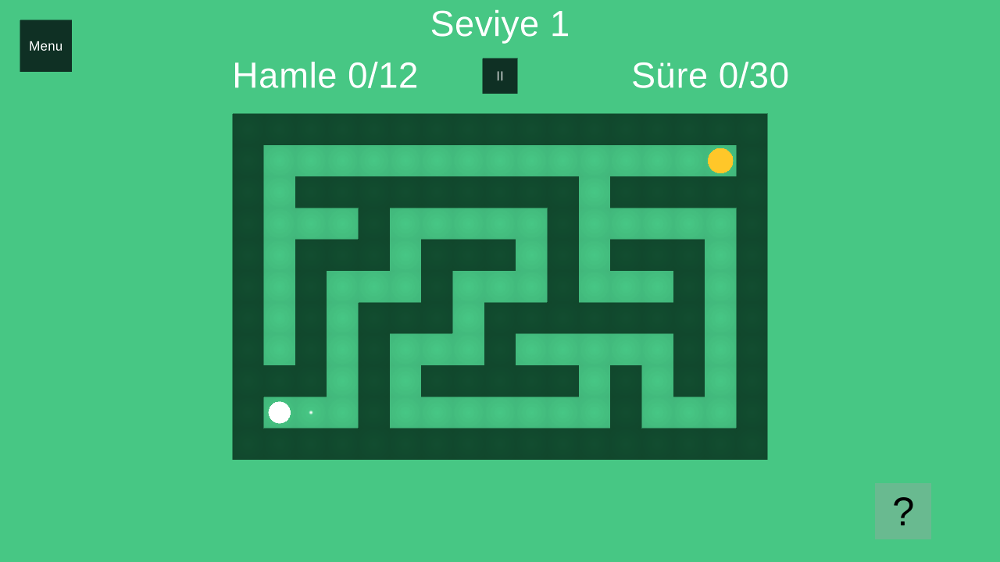

# Labirent

A 2D procedural maze puzzle designed and developed by **Ufuk Bayhan**, built with Unity and C#.



Slide through corridors, choose your route at junctions, and reach the exit. Each level tracks your moves and time against targets derived from the maze's minimum sliding-move solution.

## Features

- Seed-based maze generation with iterative depth-first backtracking.
- Breadth-first search for the minimum number of sliding moves, including corner-following rules.
- Progressive maze sizes, varied endpoints, and configurable additional openings.
- Keyboard, mouse drag, touch swipe, and directional dot controls.
- Saved level progression, move/time HUD, completion ratings, and pause/restart controls.
- Adaptive camera framing and screen safe-area support.

## My role

I designed and developed the game from start to finish: procedural generation, player movement, level progression, gameplay UI, and game integration.

## Open and play

1. Clone this repository.
2. In Unity Hub, add the cloned folder as a project.
3. Open it with **Unity 6000.3.9f1** and allow the packages and assets to import.
4. Open `Assets/Labirent/LabirentOyunu.unity` and press Play.

The first launch displays a short tutorial. Click or tap to advance through it.

| Input | Action |
| --- | --- |
| WASD / arrow keys | Choose a movement direction |
| Mouse drag / touch swipe | Choose a movement direction |
| Direction dots | Move in the selected direction |
| Menu / pause button | Pause, resume, restart, or return to level 1 |
| ? | Show the tutorial again |

## Project layout

- `Assets/Labirent`: game scene, scripts, sprites, tutorial images, and UI font.
- `Assets/Shared`: tutorial and safe-area helpers used by the scene.
- `Assets/TextMesh Pro`: font resources and shaders.
- `Assets/Editor/PortfolioBuild.cs`: standalone configuration and Windows build entry point.

## Windows build

Install Windows Build Support for Unity 6000.3.9f1. In Build Profiles, select Windows and build the included scene. The editor automation entry point `PortfolioBuild.ConfigureAndBuild` also creates a development build at `Builds/Windows/Labirent.exe`.

Generated folders such as `Library`, `Temp`, and `Builds` are excluded from Git. Asset `.meta` files are tracked to preserve Unity references.

## Validation

The Windows development build includes an opt-in smoke check:

```powershell
.\Builds\Windows\Labirent.exe -batchmode --portfolio-smoke-test -logFile smoke.log
```

It checks first-launch tutorial input handling, 40 seed/endpoint combinations for reachability and reproducibility, sliding solutions with and without corner following, an advanced level, pause/resume, restart, and completion-to-next-level flow. A successful run logs `PORTFOLIO_SMOKE_OK` and captures `docs/gameplay.png`. The check restores the prior level/tutorial preferences when it finishes.

## Credits

Game design and development: [Ufuk Bayhan](https://github.com/UfukBayhan).

Liberation Sans is provided under the SIL Open Font License; see `Assets/TextMesh Pro/Fonts/LiberationSans - OFL.txt`. TextMesh Pro resources and shaders are supplied with Unity's TextMesh Pro/uGUI tooling; their existing notices are retained.
